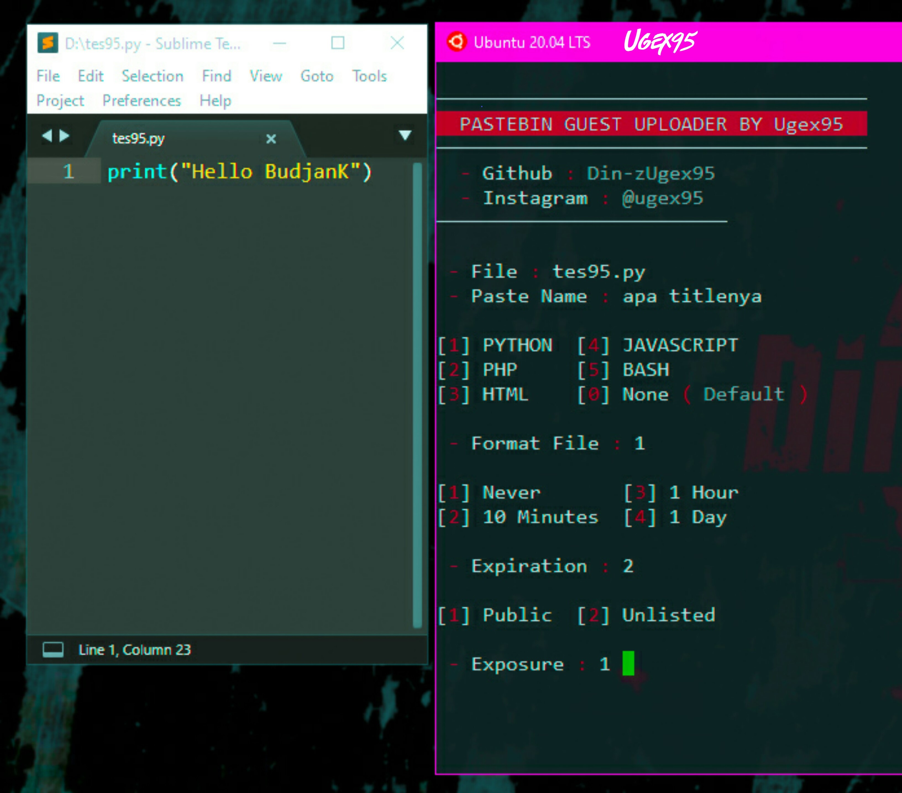
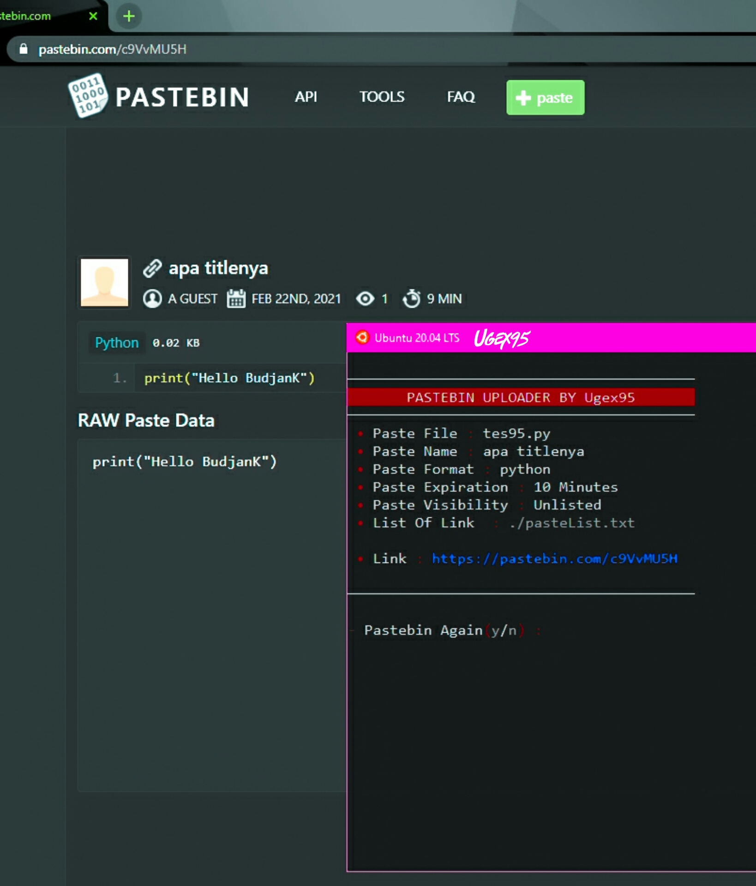

# pastebin95
Upload pastebin with CLI<br>
With GUEST account


### Installation
```bash
  apt-get install git
  apt-get install python3
  pip3 install requests
```


### Clone
```bash
 git clone https://github.com/Din-zUgex95/pastebin95
```


### Usage
```bash
  cd pastebin95
  python3 pastebin95.py
```


### Example Result
<br><br>

